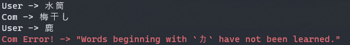

# Shiritori-Py (しりとり Py)

Demonstration of Shiritori game using [SudachiPy](https://github.com/WorksApplications/SudachiPy).

# How To Play

## Environment building

```bash
git clone https://github.com/gongitsune/siritori-py.git
cd siritori-py
python -m venv venv

# Using bash
source ./venv/bin/activate
# Using fish
source ./venv/bin/activate.fish

# package installation
pip install -r requirements.txt

mkdir data
touch ./data/text.txt # Write a sentence with the word you want to use in Shiritori here

# Parsing text to create dictionaries
python ./src/prepare.py
```

## Play

```bash
python ./src/main.py
```



# License

"Shiritori-Py" is under [MIT license](https://en.wikipedia.org/wiki/MIT_License).

Thank you!
